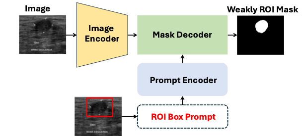

# bus-classifciation
Breast Ultrasound Image Classification with BUSI/BUSBRA Open Dataset 

이 프로젝트는 **MEDSAM 기반 약한 병변 마스크**를 활용하여 **유방 초음파 암 분류 모델**을 개발합니다. 이 모델은 ROI Box Prompt와 전이 학습을 결합하여 정확한 분류를 수행하며, BUSI 및 BUSBRA 데이터셋을 사용하여 학습합니다.

## 목차
1. [소개](#소개)
2. [데이터 준비](#데이터-준비)
3. [실행 방법](#실행-방법)
4. [환경 설정 (.env 파일)](#환경-설정-env-파일)
5. [데이터셋 클래스 예시](#데이터셋-클래스-예시)
6. [테스트 실행 및 결과 저장](#테스트-실행-및-결과-저장)
7. [연구 요약](#연구-요약)
8. [참고문헌](#참고문헌)

## 소개
### Figure


이 프로젝트는 **의료 파운데이션 모델 MEDSAM**을 사용하여 약한 병변 마스크(Weak ROI Mask)를 생성하고 이를 통해 유방 초음파 이미지의 암을 분류합니다. 이 연구에서는 BUSI와 BUSBRA 데이터셋을 통합하여 CNN과 Transformer 모델을 학습시켰으며, 전이 학습을 통해 모델 성능을 최적화하였습니다.

## 데이터 준비
1. BUSI와 BUSBRA 데이터셋을 다운로드하여 로컬 디렉토리에 저장합니다.
2. `.env` 파일 내 `DATA_DIR`과 `CSV_PATH` 변수를 설정하여 각 데이터셋 경로와 CSV 파일 경로를 지정합니다. `CSV_PATH`는 `train`과 `test`로 구분하여 지정합니다.

## 실행 방법
1. **환경 설정**: 프로젝트 폴더 내 `.env` 파일을 생성하여 환경 변수를 설정합니다.
2. **데이터셋 설정**: 분석하려는 데이터셋 파일 경로를 설정합니다. `dataset` 변수는 실행할 데이터셋이 위치한 가장 앞 디렉토리로 지정합니다.
3. **스크립트 실행**: 설정이 완료되면 `run.sh` 스크립트를 실행하여 모델을 학습하고 평가합니다.


```bash
# WandB 설정 : WandB 로깅을 활성화하려면 yes, 비활성화하려면 no로 설정
WANDB_USE='yes'
WANDB_PROJECT=binary-bus-classifier

# Python 스크립트 경로
PYTHON_SCRIPT=./script/trainer.py

# 기타 설정
RANDOM_SEED=42

# 훈련 하이퍼파라미터
FOLD_NUM=5
TRAIN_BATCH_SIZE=32
VALID_BATCH_SIZE=8
LR=0.00001
EPOCHS=50

## 데이터 경로 설정 (Binary)
DATA_DIR={YOUR_DATA_ROOT_DIR}
CSV_PATH={YOUR_CSV_PATH}
VER={YOUR_VERSION_FOR_WANDB_LOGGING}
SAVE_DIR={SAVE_DIR}
OUTLAYER_NUM=1

### 모델 설정
BACKBONE_MODEL=convnext
MODEL_TYPE='l'

```

## 스크립트 실행
bash run.sh


## Table 1: BUSI + BUSBRA 5-Fold Binary Classification Metrics

| CNN              | Input                  | Accuracy         | Precision        | Sensitivity      | Specificity      | F1-score         | AUC             |
|------------------|------------------------|------------------|------------------|------------------|------------------|------------------|-----------------|
| **ResNet**       | Image                  | 80.2%            | 80.3%            | 78.4%            | 81.9%            | 79.3%            | 83.5%           |
|                  | Image + Mask           | 87.8% (+7.6%)    | 81.6% (+1.3%)    | 85.1% (+6.7%)    | 91.1% (+9.2%)    | 83.3% (+4.0%)    | 91.2% (+7.7%)   |
|                  | Image + SAMMask        | 88.9% (+8.7%)    | 85.1% (+4.8%)    | 84.8% (+6.4%)    | 92.2% (+10.3%)   | 85.0% (+5.7%)    | 93.5% (+10.0%)  |
| **MobileNet**    | Image                  | 76.5%            | 75.0%            | 75.8%            | 77.3%            | 75.4%            | 78.1%           |
|                  | Image + Mask           | 78.6% (+2.1%)    | 77.6% (+2.6%)    | 77.4% (+1.6%)    | 79.5% (+2.2%)    | 77.5% (+2.1%)    | 80.7% (+2.6%)   |
|                  | Image + SAMMask        | 79.7% (+3.2%)    | 78.9% (+3.9%)    | 77.9% (+2.1%)    | 80.5% (+3.2%)    | 78.4% (+3.0%)    | 81.5% (+3.4%)   |
| **EfficientNet** | Image                  | 82.6%            | 81.3%            | 82.5%            | 83.8%            | 81.9%            | 86.1%           |
|                  | Image + Mask           | 83.1% (+0.5%)    | 82.3% (+1.0%)    | 83.5% (+1.0%)    | 84.9% (+1.1%)    | 82.9% (+1.0%)    | 87.3% (+1.2%)   |
|                  | Image + SAMMask        | 83.4% (+0.8%)    | 82.9% (+1.6%)    | 83.8% (+1.3%)    | 85.2% (+1.4%)    | 83.3% (+1.4%)    | 87.9% (+1.8%)   |
| **ConvNext**     | Image                  | 82.9%            | 82.4%            | 82.6%            | 84.5%            | 82.5%            | 87.4%           |
|                  | Image + Mask           | 86.7% (+3.8%)    | 83.6% (+1.2%)    | 85.1% (+2.5%)    | 88.6% (+4.1%)    | 84.3% (+1.8%)    | 91.8% (+4.4%)   |
|                  | Image + SAMMask        | 88.7% (+5.8%)    | 87.6% (+5.2%)    | 84.9% (+2.3%)    | 92.2% (+7.7%)    | 86.2% (+3.7%)    | 93.7% (+6.3%)   |
| **Attention**    | Image                  | 81.9%            | 80.4%            | 82.0%            | 82.7%            | 81.2%            | 85.7%           |
| **MaxViT**       | Image + Mask           | 82.4% (+0.5%)    | 83.9% (+3.5%)    | 84.1% (+2.1%)    | 85.2% (+2.5%)    | 84.0% (+2.8%)    | 86.7% (+1.0%)   |
|                  | Image + SAMMask        | 84.5% (+2.6%)    | 84.7% (+4.3%)    | 83.8% (+1.8%)    | 87.3% (+4.6%)    | 84.2% (+3.0%)    | 88.5% (+2.8%)   |
| **VisionTransformer** | Image           | 82.4%            | 82.5%            | 82.7%            | 84.8%            | 83.6%            | 87.5%           |
|                  | Image + Mask           | 85.7% (+3.3%)    | 84.7% (+2.2%)    | 85.1% (+2.4%)    | 86.9% (+2.1%)    | 84.9% (+1.3%)    | 90.6% (+3.1%)   |
|                  | Image + SAMMask        | 87.3% (+4.9%)    | 87.1% (+4.6%)    | 86.8% (+4.1%)    | 89.2% (+4.4%)    | 86.4% (+2.8%)    | 92.2% (+4.7%)   |
| **Swin-Transformer** | Image             | 85.2%            | 84.5%            | 83.6%            | 86.8%            | 84.0%            | 88.5%           |
|                  | Image + Mask           | 86.9% (+1.7%)    | 85.3% (+0.8%)    | 85.9% (+2.3%)    | 89.4% (+2.6%)    | 85.6% (+1.6%)    | 91.3% (+2.8%)   |
|                  | Image + SAMMask        | 88.1% (+2.9%)    | 87.1% (+2.6%)    | 86.7% (+3.1%)    | 91.8% (+5.0%)    | 86.9% (+2.9%)    | 93.4% (+4.9%)   |


## Reference
1. Sung, Hyuna, et al. "Global cancer statistics 2020: GLOBOCAN estimates of incidence and mortality worldwide for 36 cancers in 185 countries." *CA: a cancer journal for clinicians* 71.3 (2021): 209-249.
2. Youn, Bang Bu, et al. "The Diagnostic Efficacy of Mammography and Ultrasonography to Detect the Breast Cancer." *Journal of the Korean Academy of Family Medicine* 15.2 (1994): 152-158.
3. Sahu, Adyasha, Pradeep Kumar Das, and Sukadev Meher. "An efficient deep learning scheme to detect breast cancer using mammogram and ultrasound breast images." *Biomedical Signal Processing and Control* 87 (2024): 105377.
4. Deshpande, Tanvi, et al. "Auto-Generating Weak Labels for Real & Synthetic Data to Improve Label-Scarce Medical Image Segmentation." *arXiv preprint* arXiv:2404.17033 (2024).
5. Al-Dhabyani, Walid, et al. "Dataset of breast ultrasound images." *Data in brief* 28 (2020): 104863.
6. Gómez‐Flores, Wilfrido, Maria Julia Gregorio‐Calas, and Wagner Coelho de Albuquerque Pereira. "BUS‐BRA: A breast ultrasound dataset for assessing computer‐aided diagnosis systems." *Medical Physics* 51.4 (2024): 3110-
